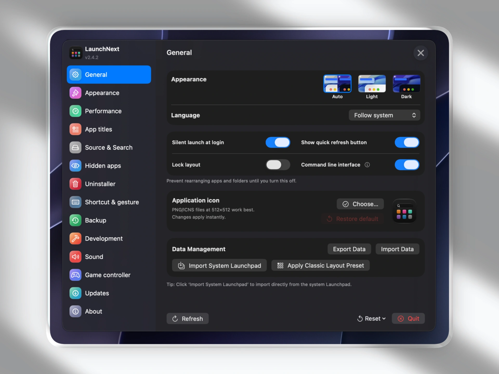
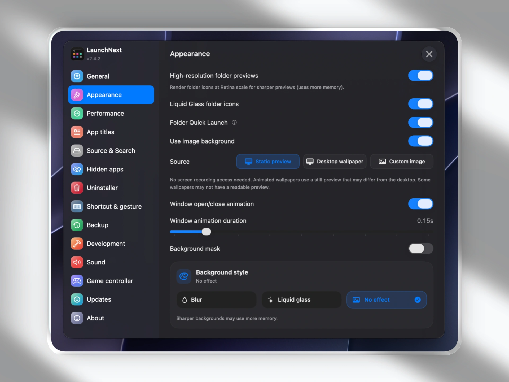

# MacLaunch

**Idiomas**: [English](../README.md) | [简体中文](README.zh.md) | [繁體中文](README.zh-TW.md) | [日本語](README.ja.md) | [한국어](README.ko.md) | [Français](README.fr.md) | [Español](README.es.md) | [Deutsch](README.de.md) | [Русский](README.ru.md) | [हिन्दी](README.hi.md) | [Tiếng Việt](README.vi.md) | [Italiano](README.it.md) | [Čeština](README.cs.md) | [Polski](README.pl.md)

## 📥 Descargar

**[Descargar aquí](https://github.com/NezumiNingen/MacLaunch/releases/latest)** - Obtén la última versión

🌐 **Sitio web**: [github.com/NezumiNingen/MacLaunch](https://github.com/NezumiNingen/MacLaunch/) \
📚 **Documentación**: [github.com/NezumiNingen/MacLaunch](https://github.com/NezumiNingen/MacLaunch/)

⭐ ¡Considera dar una estrella a [MacLaunch](https://github.com/NezumiNingen/MacLaunch) y especialmente al proyecto original [LaunchNow](https://github.com/ggkevinnnn/LaunchNow)!

| | |
|:---:|:---:|
|  |  |
|  |  |

macOS Tahoe eliminó el Launchpad, y la nueva interfaz es difícil de usar, no aprovecha completamente tu Bio GPU. Apple, al menos da a los usuarios una opción para volver atrás. Mientras tanto, aquí está MacLaunch.

*Construido sobre [LaunchNow](https://github.com/ggkevinnnn/LaunchNow) por ggkevinnnn — ¡muchísimas gracias al proyecto original!❤️*

*LaunchNow ha elegido la licencia GPL 3. MacLaunch sigue los mismos términos de licencia.*

If macOS blocks first launch, open the app once, then choose Open Anyway in System Settings > Privacy & Security.

## Lo que ofrece MacLaunch

- ✅ **Importación con un clic desde el Launchpad del sistema antiguo** - lee directamente la base de datos SQLite nativa de Launchpad para recrear carpetas, posiciones de apps y diseño
- ✅ **Organización manual de apps** - mueve apps, crea carpetas y conserva tu diseño como quieras
- ✅ **Dos rutas de renderizado** - `Legacy Engine` para compatibilidad y `Next Engine + Core Animation` para la mejor experiencia
- ✅ **Modos compacto y pantalla completa** - con soporte para ajustes separados
- ✅ **Flujo centrado en teclado** - búsqueda, navegación y apertura rápidas
- ✅ **Soporte CLI / TUI** - inspecciona y gestiona tu diseño desde la terminal
- ✅ **Activación con Hot Corner y gestos nativos** - varias formas de abrir MacLaunch globalmente
- ✅ **Arrastra apps directamente al Dock** - disponible con el motor Core Animation
- ✅ **Centro de actualizaciones con notas en Markdown** - experiencia de actualización integrada más rica
- ✅ **Herramientas de copia de seguridad y restauración** - exportaciones y recuperación más seguras
- ✅ **Accesibilidad y soporte para controladores** - voz y navegación con mando mejoradas
- ✅ **Soporte multilingüe** - amplia cobertura de localización

## Lo que macOS Tahoe nos quitó

- ❌ Sin organización personalizada de aplicaciones
- ❌ Sin carpetas creadas por el usuario
- ❌ Sin personalización por arrastrar y soltar
- ❌ Sin gestión visual de aplicaciones
- ❌ Agrupación categórica forzada

## Almacenamiento de datos

Los datos de la aplicación se almacenan en:

```text
~/Library/Application Support/MacLaunch/Data.store
```

## Integración nativa con Launchpad

MacLaunch puede leer directamente la base de datos del sistema Launchpad:

```bash
/private$(getconf DARWIN_USER_DIR)com.apple.dock.launchpad/db/db
```

## Instalación

### Requisitos

- macOS 26 (Tahoe) o posterior
- Procesador Apple Silicon o Intel
- Xcode 26 (para compilar desde el código fuente)

### Compilar desde fuente

1. **Clonar el repositorio**
   ```bash
   git clone https://github.com/NezumiNingen/MacLaunch.git
   cd MacLaunch
   ```

2. **Abrir en Xcode**
   ```bash
   open LaunchNext.xcodeproj
   ```

3. **Compilar y ejecutar**
   - Selecciona tu dispositivo objetivo
   - Pulsa `⌘+R` para compilar y ejecutar
   - O `⌘+B` para solo compilar

### Compilación por línea de comandos

**Compilación normal:**
```bash
xcodebuild -project LaunchNext.xcodeproj -scheme LaunchNext -configuration Release
```

**Binario universal (Intel + Apple Silicon):**
```bash
xcodebuild -project LaunchNext.xcodeproj -scheme LaunchNext -configuration Release ARCHS="arm64 x86_64" ONLY_ACTIVE_ARCH=NO clean build
```

## Uso

### Primeros pasos

1. MacLaunch analiza las aplicaciones instaladas en el primer inicio
2. Importa tu diseño antiguo de Launchpad o empieza desde un diseño vacío
3. Usa búsqueda, teclado, arrastre y carpetas para organizar apps
4. Abre Configuración para ajustar motor, modo de diseño, activación y automatización

### Importar tu Launchpad

1. Abre Configuración
2. Haz clic en **Import Launchpad**
3. Tu diseño y tus carpetas existentes se importan automáticamente

### Motores y modos de diseño

- **Legacy Engine** - mantiene la ruta de renderizado antigua para priorizar compatibilidad
- **Next Engine + Core Animation** - recomendado para la mejor experiencia y las funciones más nuevas
- **Compacto / Pantalla completa** - MacLaunch admite ambos modos y puede guardar ajustes separados

## Funciones clave

### Activación y entrada

- **Soporte Hot Corner** - abre MacLaunch desde una esquina configurable de la pantalla
- **Soporte experimental de gestos nativos** - acciones de pinch / tap con cuatro dedos
- **Soporte de atajos globales** - abre MacLaunch desde cualquier lugar
- **Arrastrar al Dock** - entrega apps directamente al Dock de macOS con el motor Core Animation

### Automatización y flujo avanzado

- **Soporte CLI / TUI** - inspecciona diseños, busca apps, crea carpetas, mueve apps y automatiza flujos
- **Flujos pensados para agentes** - funciona bien con agentes de IA basados en terminal y automatización shell
- **Configuración del comando desde Ajustes** - instala o elimina el comando gestionado `maclaunch`

### Experiencia de actualizaciones

- **Centro de actualizaciones dentro de la app** - comprueba actualizaciones sin salir de la aplicación
- **Notas de versión en Markdown** - visualización más rica dentro de Ajustes
- **API moderna de notificaciones** - entrega de notificaciones actualizada para versiones nuevas de macOS

### Copia de seguridad y restauración

- Crea y restaura copias desde Ajustes
- Exportación de backup más fiable
- Manejo más seguro de archivos temporales y limpieza

### Accesibilidad y navegación

- **Soporte de voz** - anuncia apps y carpetas durante la navegación
- **Soporte para controladores** - navega MacLaunch y carpetas con un gamepad
- **Interacción orientada al teclado** - búsqueda y navegación rápidas sin depender del ratón

## Rendimiento y estabilidad

- Caché inteligente de iconos para navegación fluida
- Carga diferida y escaneo en segundo plano para bibliotecas grandes
- Mejor sincronización de estado entre ajustes y navegación
- Mayor fiabilidad en actualizaciones, exportación de backups y recuperación de gestos

## Solución de problemas

### Problemas comunes

**Q: ¿La app no se inicia?**  
A: Confirma que estás en macOS 26 o posterior, elimina la cuarentena si hace falta y asegúrate de ejecutar una build de confianza.

**Q: ¿Qué motor debo usar?**  
A: `Next Engine + Core Animation` es el recomendado. Usa `Legacy Engine` solo si realmente necesitas la ruta de compatibilidad antigua.

**Q: ¿Por qué aún no existe el comando CLI?**  
A: Primero activa la interfaz de línea de comandos en Ajustes. MacLaunch puede instalar y eliminar por ti el shim gestionado `maclaunch`.

## Contribución

Las contribuciones son bienvenidas.

1. Haz un fork del repositorio
2. Crea una rama de funcionalidad (`git checkout -b feature/amazing-feature`)
3. Haz commit de tus cambios (`git commit -m 'Add amazing feature'`)
4. Sube la rama (`git push origin feature/amazing-feature`)
5. Abre un Pull Request

### Directrices de desarrollo

- Sigue las convenciones de estilo de Swift
- Añade comentarios útiles para la lógica compleja
- Prueba en varias versiones de macOS siempre que sea posible
- Evita dispersar funciones experimentales en archivos no relacionados
- Aísla integraciones removibles siempre que sea posible

## El futuro de la gestión de apps

A medida que Apple se aleja de los lanzadores personalizables, MacLaunch intenta mantener la organización manual, el control del usuario y el acceso rápido en macOS moderno.

**MacLaunch** no es solo un reemplazo de Launchpad: es una respuesta práctica a una regresión de flujo de trabajo.

---

**MacLaunch** - Recupera el control de tu lanzador de apps 🚀

*Hecho para usuarios de macOS que no quieren renunciar a la personalización.*

## Herramientas de desarrollo

- Claude Code
- Cursor
- OpenAI Codex CLI
- Perplexity
- Google

- El soporte experimental de gestos está construido sobre [OpenMultitouchSupport](https://github.com/Kyome22/OpenMultitouchSupport) y el fork de [KrishKrosh](https://github.com/KrishKrosh/OpenMultitouchSupport).❤️


